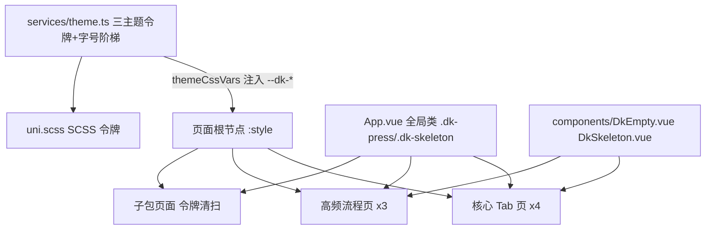

# Daykeep 小程序 UI 与交互整体优化方案

> 立项时间：2026-09-24
> 范围：核心页面优先（4 个 Tab 页 + 3 个高频流程页深度优化，其余子包页面做令牌层统一）
> 风格基调：保持现有三主题体系（极简黑白 / 深绿 / 纸感手账），在现有基调上做精致度提升

## 产品概述

「只我们」情侣生活记录小程序的整体 UI 与交互优化。在保留现有三套主题与产品气质的前提下，对使用频率最高的核心页面做精致化升级，其余页面做基础样式统一，整体呈现安静、温暖、精致的纸感极简风格。

## 核心功能

- **视觉打磨**：统一间距节奏与留白、层级对比、圆角与阴影阶梯、色彩对比度、排版细节
- **交互体验**：全站统一的按压反馈、贴合内容形状的骨架屏加载、有温度的空状态引导、克制的微动效与面板转场
- **一致性规范**：按钮、卡片、表单、标签、筛选 chips、列表行全站统一，消除页面间风格漂移
- **信息架构与易用性**：优化时光页创作卡片的层级与入口密度、约定页概览与筛选的组织方式、我的页设置分组与文案表达

**视觉效果**：点击有轻重、加载有过渡、空态有引导；整体观感从「功能完备」提升为「安静精致」，三套主题下均保持一致的完成度。

## 技术栈

- 框架：uni-app 3.0-alpha + Vue 3.4 + TypeScript + Pinia（现有栈，**不引入新依赖/组件库**，避免与现有自绘体系冲突）
- 样式：Sass + CSS 变量（复用现有 `--dk-*` 主题令牌机制，mp-weixin 支持）
- 平台：微信小程序为主，H5 兼容；验证：vue-tsc + eslint + vitest + 双端构建

## 实施策略（关键决策）

1. **令牌先行，自底向上**：先在 `services/theme.ts` 的 `themeCssVars()` 中扩展语义令牌（沿 `--dk-*` 前缀：`--dk-radius-sm/md/lg/pill`、`--dk-shadow-card`、`--dk-space-1..6`、`--dk-danger`、`--dk-skeleton-bg`、`--dk-motion-fast/base`），经页面根节点现有 `:style` 注入机制生效，天然三主题兼容；`uni.scss` 同步补充 SCSS 版与注释文档。页面只消费变量，不新增硬编码值。
2. **按压态统一用 `hover-class`**：微信小程序 `:active` 不可靠，统一在 `App.vue` 定义 `.dk-press`（scale 0.97 + opacity 0.75 + 140ms transition），页面元素加 `hover-class="dk-press"`；原生 button 需覆盖默认 `button-hover`。H5 端 uni-app 同样支持该机制。
3. **骨架屏纯 CSS**：微光扫过动画（gradient + background-position 动画），颜色走 `--dk-skeleton-bg` 替换现有硬编码色；形状贴合最终布局占位，避免加载完成跳动。
4. **空态组件化**：新建 `DkEmpty`（符号标记 + 主文案 + 副文案 + 行动按钮插槽），替换核心页各自实现的空态。
5. **微动效克制**：仅用 transform/opacity 的 CSS animation（列表首屏交错 fade-in-up、面板展开过渡、选中态弹性），120–240ms；长列表只对首屏前 N 条做入场动画，避免全量渲染开销。
6. **大文件克制改动**：`subpackages/notes/edit.vue`（4184 行）只调整 template class 与 style 块，不动 script 逻辑。
7. **信息架构调整不破坏肌肉记忆与数据链路**：不改路由路径、埋点事件名、表单字段，仅调整视觉层级、入口密度与文案。

## 系统架构



## 目录结构与改动清单

```
Daykeep/
├── uni.scss                          # [MODIFY] 新增间距/圆角/阴影/动效 SCSS 令牌及注释文档
├── services/theme.ts                 # [MODIFY] themeCssVars() 注入新语义令牌，三主题分别配值；功能色/骨架色语义化
├── App.vue                           # [MODIFY] 全局 .dk-press 按压态、.dk-skeleton 微光骨架、按钮/输入基类、safe-area 工具类
├── components/
│   ├── DkEmpty.vue                   # [NEW] 统一空状态组件：标记+标题+描述+行动插槽
│   ├── DkSkeleton.vue                # [NEW] 骨架原语（line/card/circle 形状，走主题变量）
│   ├── CreateEntrySheet.vue          # [MODIFY] 对齐新令牌与按压态
│   └── ImageGrid.vue / SwitchRow.vue # [MODIFY] 轻量对齐令牌
├── pages/
│   ├── timeline/index.vue            # [MODIFY] 深度优化：composer 层级、骨架屏、空态、按压、微动效
│   ├── notes/index.vue               # [MODIFY] 深度优化：列表骨架、筛选/搜索统一、空态
│   ├── reminders/index.vue           # [MODIFY] 深度优化：概览条、筛选 chips、卡片与操作反馈
│   └── mine/index.vue                # [MODIFY] 深度优化：设置分组、行按压态、面板过渡
└── subpackages/
    ├── notes/edit.vue                # [MODIFY] 仅样式/交互层打磨（克制，不动逻辑）
    ├── day/detail.vue                # [MODIFY] 样式/交互层打磨
    ├── quick-add/index.vue           # [MODIFY] 样式/交互层打磨
    └── (其余子包页面)                  # [MODIFY] 令牌清扫：硬编码色→--dk-*、局部骨架→全局类、圆角归一
```

## 实施注意事项

- **字号兼容**：字号阶梯有 4 档用户可调，新增样式字号必须用 `var(--dk-fs-*)`，禁止固定 rpx 字号
- **主题兼容**：mono 主题下功能色沿用现有 `--dk-feature-brand`（借用 teal）机制；paper 主题阴影需更柔和，令牌按主题差异化配置
- **性能**：微动效仅 transform/opacity；交错动画限制首屏条数；骨架屏为纯 view+CSS 零 JS 开销
- **爆炸半径控制**：不改 services 逻辑/API/路由/埋点；子包清扫仅替换 CSS 值不动结构；新增令牌不改动既有变量名，未引用页面零影响
- **安全区**：底部固定操作条统一 `padding-bottom: calc(env(safe-area-inset-bottom) + N rpx)`
- **收尾**：`npm run lint && npm run type-check && npm run test`，并在 H5 与 mp-weixin 双端、三主题下走查核心路径

## 设计方案：三主题基调下的精致化打磨

- **间距节奏**：4rpx 基网格，统一页面留白（页边 32rpx）、卡片内边距（28rpx）、列表行距与分区间距阶梯，消除各页随意取值
- **圆角/阴影**：统一圆角阶梯（小元素 12rpx / 卡片 24rpx / 胶囊 999rpx），阴影柔和低调且随主题色调微调（mono 无彩、paper 暖调）
- **按压反馈**：所有可点元素统一按压态（scale 0.97 + 透明度 0.75，140ms），建立「可点即有回应」的触觉一致性
- **骨架屏**：微光扫过动画，形状贴合真实内容布局，加载完成无跳动
- **空状态**：统一 DkEmpty 结构（符号标记 + 主文案 + 副文案 + 行动按钮），文案保持产品一贯的温暖口吻，给出下一步动作
- **微动效**：列表首屏交错淡入上移、面板/抽屉平滑展开、选中态轻弹性；全程克制（120-240ms），动效只服务于层级与状态表达
- **信息层级**：时光页创作卡降密度（三主入口突出、二级入口弱化为收拢行）；约定页概览数字条改为清晰的统计条；我的页设置分组标题强化、行高统一

## 任务分解与进度

| # | 任务 | 状态 |
|---|------|------|
| 1 | UI 审计 + 设计令牌扩展（theme.ts、uni.scss） | 已完成 |
| 2 | App.vue 全局按压态/骨架屏/按钮基类 + 新建 DkEmpty、DkSkeleton 组件 | 已完成 |
| 3 | 时光、随手记 Tab 优化 | 已完成 |
| 4 | 约定、我的 Tab 优化 | 已完成 |
| 5 | 记录编辑、日子详情、快速记一下三页打磨 | 已完成 |
| 6 | 子包令牌清扫（code-explorer 扫描 + 批量替换） | 已完成 |
| 7 | 回归验证（lint、type-check、vitest、双端三主题走查） | 已完成 |
